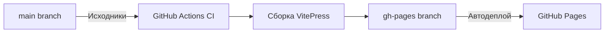

# Вики для специальности 09.02.06 «Сетевое и системное администрирование»

Проект представляет собой учебную вики-базу знаний для специальности **09.02.06** на базе [VitePress](https://vitepress.dev). 

Сама вики доступна по адресу: https://bysnik.github.io/wiki/

## 📚 Содержание вики
- ~~Подробный разбор заданий демонстрационного экзамена~~
- Учебные материалы по специальным дисциплинам:
  - Лекции и методические пособия
  - Практические и лабораторные работы
  - Рабочии программы и дополнительная документация
- База знаний по Linux с фокусом на ALT Linux

## 🛠 Техническая организация

Ветки репозитория:

    main - исходный код и контент

    gh-pages - скомпилированная статическая версия

🤝 Как помочь проекту?

Приветствуется любое участие в развитии вики:

    Отправляйте материалы и предложения на почту

    Создавайте Pull Request'ы

    Сообщайте об ошибках

📬 Контакты

    Основной контакт: bystrovno@basealt.ru

Лицензия: GNU GPL v3.0
Статус проекта: Активная разработка и наполнение контента
