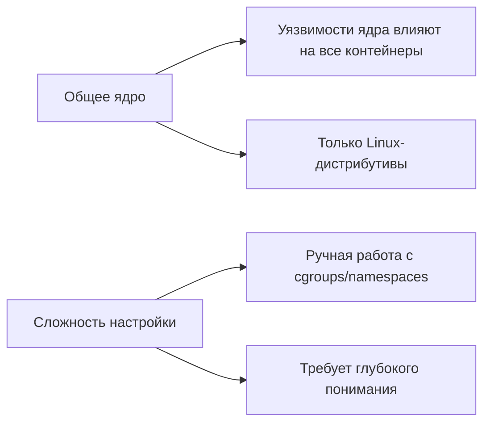
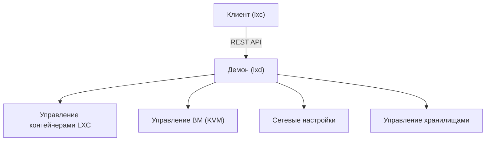

# Краткая теоретическая лекция по LXC и LXD

## LXC (Linux Containers)

### Что это?
Низкоуровневая **технология контейнеризации** операционной системы для Linux.

### Суть
Позволяет изолировать процессы в рамках одного ядра Linux, создавая виртуальные окружения ("контейнеры"), похожие на полноценные системы.

### Принцип работы
Использует механизмы ядра Linux:
- **Cgroups (Control Groups)**  
  Ограничивают и изолируют использование ресурсов:
  - CPU
  - Память
  - Диск
  - Сеть
- **Namespaces (Пространства имён)**  
  Изолируют представление процессов о системе:
  - `pid` (ID процессов)
  - `net` (сеть и интерфейсы)
  - `ipc` (межпроцессное взаимодействие)
  - `mnt` (точки монтирования)
  - `uts` (hostname и доменное имя)
  - `user` (ID пользователей)
  - `cgroup` (cgroup namespace)

### Преимущества перед виртуальными машинами
| Характеристика       | Преимущество                                  |
|----------------------|-----------------------------------------------|
| **Легковесность**    | Используют ядро хоста, нет эмуляции оборудования |
| **Скорость запуска** | Секунды вместо минут                          |
| **Эффективность**    | Минимальные накладные расходы ресурсов         |
| **Плотность**        | Большее количество контейнеров на единицу железа |

### Ограничения и особенности


## LXD (Linux Container Daemon)

### Что это?
Высокоуровневый **менеджер контейнеров и виртуальных машин**, построенный поверх LXC.

### Основные функции
```mermaid
bar
    title Ключевые возможности LXD
    xAxis Возможности
    yAxis Процент
    "Управление контейнерами/ВМ" : 25
    "Централизованные образы ОС" : 20
    "Снапшоты и миграция" : 15
    "Гибкие сети и хранилища" : 15
    "Кластеризация" : 10
    "REST API" : 10
    "Безопасность" : 5
```

### Архитектура


### Ключевые преимущества
- **Упрощение работы**  
  Сокрытие сложности низкоуровневых команд LXC
- **Безопасность**  
  AppArmor, Seccomp, изоляция ресурсов
- **Экосистема образов**  
  Поддержка Ubuntu, CentOS, Debian, Alpine
- **Профессиональные функции**  
  - Live-миграция
  - Профили ресурсов
  - Поддержка ZFS/btrfs/Ceph
  - Кластерное управление

## Сравнение LXC и LXD

| Критерий         | LXC                          | LXD                          |
|------------------|------------------------------|------------------------------|
| **Уровень**      | Низкоуровневый движок         | Высокоуровневый оркестратор  |
| **Управление**   | Ручная работа с namespaces    | Удобный CLI/REST API         |
| **Безопасность** | Базовые настройки            | AppArmor/Seccomp "из коробки"|
| **Функции**      | Контейнеризация              | +ВМ, снапшоты, кластеризация |
| **Сложность**    | Требует экспертных знаний    | Доступно администраторам     |

## Когда использовать?
**LXC:**
- Низкоуровневые задачи контейнеризации
- Кастомные скрипты и интеграции
- Специфические эксперименты с ядром

**LXD:**
- Промышленное управление инфраструктурой
- Разработка и тестирование сред
- Гибридные среды (контейнеры + ВМ)
- Микросервисные архитектуры

**Ключевая аналогия**:  
LXC — это "кирпичи", а LXD — "завод по производству зданий" из этих кирпичей.  
**Технологический стек**: LXD = LXC + Система управления + Безопасность + Enterprise-функции.

