# АННОТАЦИЯ

Настоящий документ представляет собой руководство администратора Комплекта
компонент технологической платформы «1С:Предприятие 8» ШАРД.10002-02 (ККТП «1С:Предприятие 8»).

Документ предназначен администратору безопасности ККТП «1С:Предприятие 8» (администратору).

Документ дает общее описание программы и её отличие о обычной версии технологической платформы «1С:Предприятие 8»; раскрывает описание действий по приемке средства; действий по безопасной установке и настройке средства; действий по реализации функций безопасности среды функционирования; указания по ограничению утечек информации.

# 1. ОБЩИЕ СВЕДЕНИЯ О ПРОГРАММЕ

ККТП «1С:Предприятие 8» функционирует только в среде операционной системы специального назначения Astra Linux Special Edition версий 1.6 и 1.7. Функционирование в среде иных операционных систем невозможно.

Функционирование средства возможно только на средствах вычислительной техники процессорной архитектуры x86-64.

В качестве системы управления базами данных используется СУБД PostgreSQL из состава ОС СН Astra Linux Special Edition.

СУБД PostgreSQL должна быть установлена до начала установки ККТП «1С:Предприятие 8».
Администратор средства должен владеть навыками работы в среде операционных систем Linux и знать правила установки, настройки и администрирования прикладных решений системы программ «1С:Предприятие 8». Желательно, чтобы администратор средства владел навыками администрирования ОС СН Astra Linux Special Edition в части настройки функциональности мандатного разграничения доступа.

## 1.1. Рекомендации по установке программы

Рекомендуется производить установку программ и активацию программных лицензий до установки средств вычислительной техники в состав информационных систем предприятий и организаций, поскольку при активации программных лицензий требуется наличие доступа к сети Интернет со стороны вспомогательных средств вычислительной техники.

## 1.2. Рекомендации по настройке программы

Настоятельно рекомендуется, выполнять действия по установке и настройке программы в строгой последовательности с пунктами настоящего Руководства. Как показывает практика, любые отклонения от описанного порядка установки и настройки программы влекут за собой необходимость обращения за поддержкой к производителю программы.

## 1.3. Рекомендации по установке прикладных решений

Установка прикладных решений системы программ «1С:Предприятие 8» для ККТП «1С:Предприятие 8» несколько отличается от процесса установки на иные операционные системы семейства Linux.

### 1.3.1. Установка оригинальных прикладных решений

Под оригинальными прикладными решениями принято понимать конфигурации, написанные средствами 1С:Предприятия с нуля, как с использованием инструментария Библиотеки стандартных подсистем, так и без.

Установка оригинальных прикладных решений производится из терминала от имени администратора ККТП «1С:Предприятие 8».

Для установки следует перейти в каталог установочных файлов прикладного решения и выполнить команду sh ./setup

Либо команду ./setup.x86_64 для прикладных решений, разработанных специально для использования в среде ККТП «1С:Предприятие 8».

Начнется процесс установки (описан в подразделе 5.4). Далее следовать инструкциям, описанным в настоящем руководстве.

### 1.3.2. Установка типовых прикладных решений

Типовые прикладные решения системы программ «1С:Предприятие 8», например, «1С:Бухгалтерия 8», «1С:Бухгалтерия государственного учреждения 8», «1С:Свод отчетов 8 ПРОФ», «1С:ERP Управление предприятие 2» и иные, выпускаемые непосредственно фирмой «1С», без выполнения дополнительных настроек установлены быть не могут.

Данное обстоятельство связано с особенностями функционирования ККТП «1С:Предприятие 8» в части касающейся выполнения требований мандатного принципа контроля доступа.

Порядок установки типовых прикладных решений:

1) Выполнить создание пустой информационной базы типового прикладного решения с использованием технологической платформы «1С:Предприятие 8» версии 8.3.24.1548 или более ранней, но не менее 8.3.13.1644.
2) Выполнить процедуру первоначального заполнения информационной базы.
3) Выгрузить полученную информационную базу в файл DT.
4) Перенести полученный файл DT на компьютер с установленным ККТП «1С:Предприятие 8».
5) Создать информационную базу по правилам, описанным в подразделе 5.4 настоящего руководства.
6) Загрузить в созданную информационную базу полученный файл DT.
7) Снять конфигурацию с поддержки выбрав режим «Объект поставщика редактируется с сохранением поддержки» (рис.30).
8) Значения свойства конфигурации «Режим совместимости» выставить в положение «Не использовать»
9) Выполнить процедуры создания общих реквизитов мандатного разграничения доступа и установки их значение (подраздел 5.4.4).
10) Выполнить первый запуск. В случае отказа в запуске 1С:Предприятия по причине наличия процедур проверки совместимости – закомментировать участки кода встроенного языка 1С:Предприятия.

Пример:

```
//Если ЗначениеЗаполнено(НеПоддерживаемаяВерсияПлатформы) Тогда
//ВызватьИсключение СтроковыеФункцииКлиентСервер.ПодставитьПараметрыВСтроку(
//НСтр("ru = 'Режим совместимости конфигурации с 1С:Предприятием версии %1 не поддерживается.
//
 |Для запуска установите в конфигурации режим совместимости ""Не использовать"" при разработке
на версии %2
//
 |(или ""Версия %2"" при разработке на более старших версиях).'"),
//НеПоддерживаемаяВерсияПлатформы, ПоддерживаемаяВерсияПлатформы);
//КонецЕсли;
```

Обновление версий типовых прикладных решений требует обязательного присутствия специалиста по конфигурированию, поскольку, как уже указывалось выше, прикладное решения будет снято с поддержки.

### 1.3.3. Особенности установки отраслевых и специализированных решений

Под отраслевыми и специализированными решениями системы программ «1С:Предприятие 8» следует понимать ряд прикладных решений, нацеленных на максимальное соответствие потребностям в автоматизации важных для предприятий бизнес-процессов, специфичных для определенных отраслей экономики либо для решения специализированных задач управления.

Подробнее об отраслевых решениях написано на сайте https://solutions.1c.ru/

ВАЖНО!

Отраслевые и специализированные прикладные решения системы программ «1С:Предприятие 8», использующие в качестве защиты от нелегального копирования внешнюю компоненту Системы лицензирования конфигураций (https://solutions.1c.ru/catalog/slk/features ) в среде ККТП «1С:Предприятие 8» функционировать не будут.

# 2. ОТЛИЧИЯ ККТП «1С:ПРЕДПРИЯТИЕ 8»

ККТП «1С:Предприятие 8» отличается от типовых версий технологической платформы «1С:Предприятие 8». Эти особенности следует учитывать при настройке программы, а также в процессе конфигурирования прикладных решений.

## 2.1. Терминология

В настоящем Руководстве используются следующие термины и определения:

Информационная база – логически целостная система, включающая в себя конфигурацию базы данных, базу данных информационной базы, пользователей информационной базы, а также дополнительную информацию необходимую для администрирования, включающую параметры информационной базы. Информационная база хранится в базе данных СУБД PostgreSQL версии из состава операционной системы специального назначения Astra Linux Special Edition.

Конфигурация базы данных – совокупность настроек и скриптов, исполняемая средствами ККТП «1С:Предприятие 8». Основу конфигурации базы данных составляет структура объектов конфигурации, которая описывается средствами визуального конструирования. Особенности и взаимосвязи объектов конфигурации задаются с помощью их свойств и описываются на встроенном языке.

База данных информационной базы (БД ИБ) – хранилище данных предметной области, поддерживаемое конфигурацией.

Параметры информационной базы – устанавливаемые администратором информационной базы настройки, включающие в себя метки мандатного разграничения доступа информационной базы.

Узел многоуровневой информационной базы (узел МУИБ) - информационная база из состава многоуровневой информационной базы с настроенными метками иерархического уровня классификации и неиерархической категории классификации.

Многоуровневая информационная база (МУИБ) – это совокупность узлов МУИБ, между которыми поддерживается синхронизация конфигурации и данных. Многоуровневая информационная база имеет иерархическую структуру. Иерархическая структура представляет собой последовательность узлов распределенной информационной базы, каждый из которых имеет свою метку иерархического уровня классификации и метку неиерархической категории классификации.

Однонаправленный обмен – операция переноса информации в целях синхронизации информации в многоуровневой информационной базе.

Однонаправленный обмен обеспечивает передачу данных из узла МУИБ с меньшим значением уровня ММРД узла МУИБ в узел МУИБ с большим значением уровня ММРД узла МУИБ.

В процессе однонаправленного обмена, метки мандатного разграничения доступа прикладных данных переносятся в неизменном виде.

Платформа «1С:Предприятие 8» – среда исполнения конфигураций ККТП «1С:Предприятие 8».

Файловый вариант работы – вариант работы, рассчитанный на персональную работу одного пользователя или работу небольшого количества пользователей в локальной сети.

В этом варианте все данные информационной базы располагаются в одном файле – файловой базе данных.

При работе в файловом варианте не используется кластер серверов и вся обработка данных выполняется на клиентских компьютерах.

Клиент-серверный вариант работы – вариант работы, предназначенный для использования в рабочих группах или в масштабе предприятия.

Представляет собой совокупность трех взаимодействующих частей:

- клиентское приложение;
- кластер серверов;
- СУБД стороннего производителя.

Конфигуратор – один из двух режимов работы клиентского приложения. В этом режиме производится конфигурирование и выполняется администрирование информационной базы. Из режима конфигуратора доступа к данным информационной базы нет.

1С:Предприятие – основной режим работы ККТП «1С:Предприятие 8», в котором работают пользователи. В этом режиме пользователи выполняют прикладные задачи.

Прикладные данные информационной базы (прикладные данные ИБ) – данные базы данных информационной базы.

Элемент прикладных данных – единичный объект прикладных данных ИБ, представляющий некую законченную сущность (элемент справочника, запись регистра).

Виды прикладных данных – прототипы прикладных данных, описывающих одну прикладную сущность и имеющих одинаковую структуру (справочник, документы, отчеты, регистры, константы и т.п.)

Объекты доступа – в ККТП «1С:Предприятие 8» существует два вида объектов доступа:

а) прикладные данные;
б) административные сервисы и настройки:
- конфигурация базы данных;
- пользователи информационной базы;
- список активных пользователей;
- информационная база;
- записи журнала регистрации;
- настройки журнала регистрации;
- параметры информационной базы.

Пользователь информационной базы (пользователь ИБ) – учетная запись в информационной базе, определяющая набор доступных прав. Является субъектом доступа.

Метки мандатного разграничения доступа (ММРД) – метки иерархического уровня классификации (уровни) и неиерархических категорий (категории) классификации, назначаемые субъектам и объектам.

Уровни и категории определяются целыми числами. Включенные и отключенные категории определяются битовой маской целого числа, определяющего категорию.

Уровень 1 < Уровень 2, если значение целого числа определяющего Уровень 1 меньше значения целого числа, определяющего Уровень 2.

Уровень 1 = Уровень 2, если значение целого числа определяющего Уровень 1 равно значению целого числа, определяющего Уровень 2.

Категории 1 < Категорий 2, если значение битовой маски целого числа, определяющего категории 1 является подмножеством набора бит значения битовой маски целого числа, определяющего категории 2

Категории 1 = Категории 2, если значение целого числа определяющего Категории 1 равно значению целого числа, определяющего Категории 2

ММРД 1 < ММРД 2, если Уровень 1 < Уровень 2 и Категория 1 < Категория 2.

ММРД 1 = ММРД 2, если Уровень 1 = Уровень 2 и Категория 1= Категория 2.

ММРД 1 <= ММРД 2, если Уровень 1 <= Уровень 2 и Категория 1 <= Категория 2.

ММРД операционной системы (ММРД ОС) – метки операционной системы специального назначения Astra Linux Special Edition 1.6.

ММРД информационной базы (ММРД узла МУИБ) – ММРД, назначаемые узлу многоуровневой информационной базы в целом, включая его пользователей. Значения ММРД ИБ являются параметрами ИБ и назначаются только администратором ИБ.

ММРД узла МУИБ представляют собой метки мандатного разграничения доступа, назначаемые субъектам доступа – пользователям информационной базы.

ММРД прикладных данных информационной базы (ММРД ПД ИБ) – ММРД, назначаемые элементам прикладных данных информационной базы.

## 2.2. Функциональность мандатного разграничения доступа

Главным отличием ККТП «1С:Предприятие 8» от обычной версии технологической платформы «1С:Предприятие 8» является реализация требований мандатного разграничения доступа.

### 2.2.1. Метки мандатного разграничения доступа данных

В ККТП «1С:Предприятие 8» введены дополнительные параметры информационной базы (ИБ), реализующие метки мандатного разграничения доступа ИБ:

1) Уровень мандатного разграничения доступа (Level of mandatory access control) : Целое число [0; 999] – значение уровня МРД;

- Для новой ИБ значение устанавливается в 0;
- Запрещается изменять значение в меньшую сторону – исключение:

Уменьшение значений меток мандатного доступа информационной базы запрещено!

2) Категории мандатного разграничения доступа (Categories of mandatory access control) : Целое число [0; 2^64 - 1] – число, битовая маска которого задает «включенные» категории (1) и «отключенные» (0):

- Для новой ИБ значение устанавливается в 0;
- Запрещается изменять значение, если при этом «отключаются» какие-либо категории – исключение:

Уменьшение значений меток мандатного доступа информационной базы запрещено!

Метки МРД ИБ также являются метками МРД ее пользователей, как субъектов доступа.

Для возможности просмотра и редактирования меток МРД ИБ, в меню конфигуратора «Администрирование» добавлена кнопка «Метки мандатного разграничения доступа информационной базы...». Этот пункт меню открывает одноименный диалог.

Если значение какой-либо метки было увеличено, то перед записью выдается предупреждение:

«Изменение значений меток мандатного разграничения доступа ИБ допустимо только в сторону увеличения.

После сохранения новых значений меток вернуться к старым значениям будет невозможно.
Продолжить?»

### 2.2.2. Дополнительные события Журнала регистрации

Для регистрации удачных или неудачных изменений меток МРД ИБ введены отдельные события журнала регистрации:


1) _$InfoBase$_.LabelsOfMandatoryAccessControlUpdate (Информационная база. Изменение меток мандатного разграничения доступа)
Важность: Информация
2) _$InfoBase$_.LabelsOfMandatoryAccessControlUpdateError (Информационная база. Ошибка изменения меток мандатного разграничения доступа)
Важность: Ошибка
В структуре «Данные которых выводятся новые значения измененных меток»:
3) УровеньМандатногоРазграниченияДоступа (LevelOfMandatoryAccessControl) – Число;
4) КатегорииМандатногоРазграниченияДоступа (CategoriesOfMandatoryAccessControl) – Число;

### 2.2.3. Новые методы внутреннего языка 1С:Предприятия

Добавлены методы внутреннего языка для получения меток МРД ИБ:

1) ПолучитьУровеньМандатногоРазграниченияДоступаИнформационнойБазы (GetInfoBaseLevelOfMandatoryAccessControl)
- Параметры: отсутствуют
- Возвращаемое значение: Число
2) ПолучитьКатегорииМандатногоРазграниченияДоступаИнформационнойБазы (GetInfoBaseCategoriesOfMandatoryAccessControl)
- Параметры: отсутствуют
- Возвращаемое значение: Число
Методы программной модификации меток МРД ИБ специально не реализованы.

### 2.2.4. Взаимодействие с ОС СН Astra Linux Special Edition

При работе с ОС СН Astra Linux Special Edition проводится проверка значений меток МРД ИБ на соответствие значениям меток процесса ККТП «1С:Предприятии 8». При несоответствии хотя бы одной метки, всем сеансам вне режима конфигуратора выводится исключение:

Метки мандатного разграничения доступа текущего процесса ОС не соответствуют меткам информационной базы.

## 2.3. Метки мандатного разграничения доступа информационной базы

Метки МРД прикладных данных, как объектов доступа, реализуются с помощью специальных общих реквизитов:

- УровеньМандатногоРазграниченияДоступа;
- КатегорииМандатногоРазграниченияДоступа.

Совокупность значений этих реквизитов образуют метку МРД прикладных данных (ПД).
Все объекты метаданных кроме планов обмена, констант, журналов документов и внешних источников данных должны входить в состав этих специальных общих реквизитов.

Внимание: Запрещено хранить и обрабатывать защищаемые данные в планах обмена, константах и внешних источниках данных!

Описание общих реквизитов мандатного разграничения доступа:

### 2.3.1. Общий реквизит: УровеньМандатногоРазграниченияДоступа

В ККТП «1С:Предприятие 8» осуществляется контроль наличия в конфигурации обязательного общего реквизита (ОР УМРД) с фиксированными свойствами:

- Имя: УровеньМандатногоРазграниченияДоступа (LevelOfMandatoryAccessControl)
- Тип: < Число >;
- Длина: 3
- Точность: 0;
- Неотрицательное: <Истина>;
- Автоиспользование: <Использовать>;
- Разделение данных: <Не использовать>;
- История данных: <Использовать>;
- Выделять отрицательные: < Ложь >;
- Минимальное значение: 0;
- Максимальное значение: 999;
- Значение заполнения: 0;
- Проверка заполнения: < Не проверять >;

и редактируемыми администратором свойствами:

- Синоним: Уровень мандатного разграничения доступа;
- Комментарий: <Пустая строка>;
- Индексировать: <Индексировать>;
- Полнотекстовый поиск: <Не использовать>;
- Формат: <Пустая строка>;
- Формат редактирования: <Пустая строка>;
- Подсказка: <Пустая строка>;
- Заполнять из данных заполнения: < Ложь >;
- Быстрый выбор: < Авто >;
- Создание при вводе: < Авто >;
- История выбора при вводе: < Авто >.

### 2.3.2. Общий реквизит: КатегорииМандатногоРазграниченияДоступа

В ККТП «1С:Предприятие 8» осуществляется контроль наличияобязательного общего реквизита (ОР КМРД) с фиксированными свойствами:

- Имя: КатегорииМандатногоРазграниченияДоступа (СategoriesOfMandatoryAccessControl)
- Тип: < Число >;
- Длина: 20
- Точность: 0;
- Неотрицательное: <Истина>;
- Автоиспользование: < Использовать >;
- Разделение данных: < Не использовать >;
- История данных: < Использовать >;
- Выделять отрицательные: < Ложь >;
- Минимальное значение: 0;
- Максимальное значение: 18446744073709551615;
- Значение заполнения: 0;
- Проверка заполнения: < Не проверять >;
и редактируемыми администратором свойствами:
- Синоним: Категории мандатного разграничения доступа;
- Комментарий: <Пустая строка>;
- Индексировать: <Индексировать>;
- Полнотекстовый поиск: <Не использовать>;
- Формат: <Пустая строка>;
- Формат редактирования: <Пустая строка>;
- Подсказка: <Пустая строка>;
- Заполнять из данных заполнения: < Ложь >;
- Быстрый выбор: < Авто >;
- Создание при вводе: < Авто >;
- История выбора при вводе: < Авто >.

### 2.3.3. Настройка специальных общих реквизитов

Для облегчения настройки специальных общих реквизитов, в ККТП «1С:Предприятие 8», в меню Конфигуратора «Конфигурация» добавлена кнопка «Настроить реквизиты мандатного разграничения доступа». При нажатии этой кнопки, происходит автоматическое добавление и настройка специальных общих реквизитов.

1) Если специальные общие реквизиты были успешно настроены, то выводится сообщение:
«Реквизиты мандатного разграничения доступа настроены»
2) Если специальные общие реквизиты уже ранее были настроены, то выводится сообщение:
«Реквизиты мандатного разграничения доступа уже настроены»
3) Если дерево метаданных по тем или иным причинам заблокировано для добавления отсутствующих специальных общих реквизитов (конфигурация на поддержке, при работе с хранилищем), то выводится сообщение об ошибке настройки:
«Конфигурация недоступна для изменения»
4) Если какие-либо специальные общие реквизиты неправильно настроены и заблокированы для изменения в дереве метаданных (конфигурация на поддержке, при работе с хранилищем), то выводится сообщение об ошибке настройки:
«Следующие общие реквизиты недоступны для изменения:
< Имена объектов метаданных >»
5) Если уже присутствуют общие реквизиты с зарезервированными для специальных общих реквизитов именами, то выводится сообщение об ошибке настройки:
«В конфигурации присутствуют объекты метаданных с зарезервированными именами:
< Имена объектов метаданных >»

### 2.3.4. Контроль настройки специальных общих реквизитов

Если обнаружено отсутствие какого-либо специального общего реквизита или его фиксированные свойства были изменены, то

1) при старте любого сеанса вне режима конфигуратора генерируется необрабатываемое исключение:
«Нарушена целостность системы мандатного разграничения доступа»
2) в конфигураторе под правами Администратора, при открытии конфигурации или при попытке обновления конфигурации базы данных выводится сообщение об ошибке:
Конфигурация некорректно настроена для текущего варианта платформы:
< Список ошибок >
Обновление конфигурации базы данных при этом не производится.

### 2.3.5. Описание правили мандатного разграничения доступа

Пусть:

- ММРД ИБ – метки МРД ИБ;
- ММРД ПД – метки МРД прикладных данных;
- Администратор – пользователь ИБ с правом Администрирование;
- Пользователь – пользователь ИБ без права Администрирование.
Далее под регистрами с регистратором также подразумеваются:
- последовательности;
- перерасчеты, где регистратором является объект перерасчета.

#### 2.3.5.1. Правила чтения

Правила чтения прикладных данных в контексте МРД:
- Администратор и Пользователь:
Данные по ММРДПД дополнительно не фильтруются.

#### 2.3.5.2. Правила записи

Правила записи прикладных данных в контексте МРД:

1) Привилегированный режим игнорируется.
2) Администратор и Пользователь
- При создании новых прикладных данных (до записи в базу данных) значение ММРД ПД устанавливается в значение ММРД ИБ.
- Проверка возможности записи данных выполняется между обработчиками внутреннего языка ПередЗаписью и ПриЗаписи.
- Факт изменения или ошибки изменения ММРД ПД отражается в журнале регистрации.
3) Администратор и Пользователь (для регистров с регистратором):
- Перед записью прикладных данных, перед обработчиком ПередЗаписью внутреннего языка, ММРД ПД каждой записи набора записей автоматически устанавливается средством в значение меток МРД регистратора.
- Запись данных разрешена при условии, что ММРД ПД каждой записи набора записей равна меткам МРД регистратора, иначе исключение:
«Нарушение мандатного разграничения доступа!»
4) Администратор (для объектных типов и записей регистра без регистратора):
Запись данных разрешена при условии, что ММРД ПД меньше или равны ММРД ИБ, иначе исключение:
«Нарушение мандатного разграничения доступа!»
5) Пользователь (для объектных типов и записей регистра без регистратора):
- Изменение значений ММРД ПД запрещено – при записи исключение:
«Нарушение мандатного разграничения доступа!»
Разрешено изменять прикладные данные с ММРД ПД равными ММРД ИБ. В противном случае – при записи исключение:
«Нарушение мандатного разграничения доступа!»
6) Пользователь (для записей регистра без регистратора):
При записи набора записей в режиме перезаписи выполняется контроль того, что ММРД ПД удаляемых из базы данных записей равны ММРД ИБ. Иначе исключение:
«Нарушение мандатного разграничения доступа!»

#### 2.3.5.3. Правила удаления

Правила удаления прикладных данных в контексте МРД:
1) Привилегированный режим игнорируется.
2) Администратор (для объектных типов):
- Разрешается удаление элементов с любыми ММРД ПД.
3) Пользователь (для объектных типов):
- Разрешается удаление элементов только с ММРД ПД равными ММРД ИБ.

### 2.3.6. Представление значений общих реквизитов

Для реализации пользовательских (общепринятых, «человеколюбивых») представлений меток МРД прикладных данных, конфигурация должна быть специальным образом доработана на местах.
Например:

- допускается ввести дополнительные общие реквизиты, хранящие эти представления, которые обновляются в общем обработчике «ПередЗаписью».
- в динамическом списке использовать обработчик «ПриПолученииДанных».

### 2.3.7. Системные формы

В системных формах строка представления элемента объектного типа и записи регистра дополнены информацией со значениями ОР УМРД и/или ОР КМРД:

- Если ОР УМРД и ОР КМРД равны 0, но ничего дополнительного не выводится;
- Если ОР УМРД >= 0 и ОР КМРД > 0:
< Текущее представление > [ < Значение УМРД >,< Значение ОР КМРД >]
- Если ОР УМРД > 0 и ОР КМРД = 0:
< Текущее представление > [ < Значение УМРД >]
Например:
- Продажа 00016 от 01.12.18 [1;2] (Документ);
- Продажа 00017от 01.12.18 [0;2] (Документ);
- Продажа 00018т 01.12.18 [1] (Документ).

### 2.3.8. Дополнительные события журнала регистрации

Для регистрации удачных или неудачных изменений меток МРД прикладных данных введены отдельные события журнала регистрации с полями, аналогичными полям события _$Data$_.Update:

1) _$Data$_.LabelsOfMandatoryAccessControlUpdate (Данные. Изменение метки мандатного разграничения доступа)
Важность: Информация
2) _$Data$_.LabelsOfMandatoryAccessControlUpdateError (Данные. Ошибка изменения метки мандатного разграничения доступа)
Важность: Ошибка

## 2.4. Ограничения ККТП «1С:Предприятие 8»

Специалистам по конфигурированию прикладных решений системы программ «1С:Предприятие 8» следует учитывать, что ряд привычных функций, разрешенных к применению в обычной версии технологической платформы, запрещены к использованию в ККТП «1С:Предприятие 8».

### 2.4.1. Запрет запуска толстого клиента

При попытке соединения с ИБ с помощью толстого клиента пользователем без административных прав выдается исключение:
Запуск толстого клиента запрещен для данного варианта платформы.

### 2.4.2. Запрет работы с веб-клиентом

При попытке соединения с ИБ с помощью веб-клиента пользователю выдается исключение:
Запуск веб-клиента запрещен для данного варианта платформы.

### 2.4.3. Запрет работы с мобильным клиентом

При попытке соединения с ИБ с помощью мобильного клиента пользователю выдается исключение:
Запуск мобильного клиента запрещен для данного варианта платформы.

### 2.4.4. Запрет устанавливать право Администрирование

При вызове метода ПользовательИнформационнойБазы.Записать() проверяется попытка установки отсутствующего права Администрирования у пользователя и, в случае таковой, выдает обрабатываемое исключение:
Программное добавление административных прав пользователю запрещено!

### 2.4.5. Заблокирована Система взаимодействия

В данном варианте платформы блокируется возможность работы с системой взаимодействия следующим образом:

При запуске любого сеанса кроме конфигуратора проверяется регистрация ИБ в системе взаимодействия. При наличии такой регистрации, запуск сеанса блокируется с исключением:

Информационная база зарегистрирована в системе взаимодействия.

Работа с системой взаимодействия запрещена для данного варианта платформы.

При вызове методов:
- ВыполнитьРегистрациюИнформационнойБазы,
- ВыполнитьРегистрациюИнформационнойБазыАсинх,
- НачатьРегистрациюИнформационнойБазы,
объекта МенеджерСистемыВзаимодействия контекста генерируется обрабатываемое исключение:
Работа с системой взаимодействия запрещена для данного варианта платформы.

### 2.4.6. Заблокирована Система аналитики

В данном варианте платформы блокируется возможность работы с системой аналитики следующим образом:

При запуске любого сеанса кроме конфигуратора проверяется, задан ли сервер аналитики. При наличии, запуск сеанса блокируется с исключением:

Для информационной базы установлен адрес сервера системы аналитики.

Работа с системой аналитики запрещена для данного варианта платформы.

При попытке любого подключения к платформе от сервера аналитики, сеанс блокируется с исключением:

Работа с системой аналитики запрещена для данного варианта платформы.

При вызове методов:
- Открыть,
- ПолучитьСоединение,
- УстановитьАдресСервераСистемыАналитики
объекта МенеджерСистемыАналитики генерируется обрабатываемое исключение:
Работа с системой аналитики запрещена для данного варианта платформы.

### 2.4.7. Заблокирована Система копий базы данных

В данном варианте платформы блокируется возможность работы с копиями баз данных (в том числе с акселератором) следующим образом:

При запуске любого сеанса кроме конфигуратора проверяется наличие копий БД. При их наличии запуск сеанса блокируется с исключением:

В информационной базе определены копии базы данных.

Работа с системой копий базы данных запрещена для данного варианта платформы.

При вызове методов:
- Добавить,
- Обновить,
- УстановитьВерсиюСтандартнойРепликации
объекта МенеджерКопийБазыДанных генерируется обрабатываемое исключение:
Работа с системой копий базы данных запрещена для данного варианта платформы.

### 2.4.8. Заблокирована Система распознавания речи

В данном варианте платформы блокируется возможность работы с системой распознавания речи следующим образом:

При запуске любого сеанса кроме конфигуратора проверяется доступность моделей распознавания речи. При их доступности запуск сеанса блокируется с исключением:

Обнаружены доступные модели распознавания речи.

Работа с системой распознавания речи запрещена для данного варианта платформы.

При вызове методов:
- ВыполнитьОтложенноеРаспознавание
- ВыполнитьРегистрациюИнформационнойБазы,
- ВыполнитьРегистрациюСеанса,
- НачатьПотоковоеРаспознавание,
- УстановитьДанныеРаботыСРечьюИнформационнойБазы,
- УстановитьДополнительнуюГрамматикуИнформационнойБазы,
- УстановитьДополнительнуюГрамматикуСеанса,
- УстановитьМодельРаспознаванияДляИнформационнойБазы,
- УстановитьПараметрыВнешнегоПодключенияИнформационнойБазы,
- УстановитьПараметрыВнешнегоПодключенияСеанса
объекта МенеджерРаботыСРечью генерируется обрабатываемое исключение:
Работа с системой распознавания речи запрещена для данного варианта платформы.

### 2.4.9. Заблокированы Сервисы интеграции

В данном варианте платформы блокируется использование сервисов интеграции следующим образом:

При вызове метода
- ВыполнитьОбработку()
объекта СервисыИнтеграцииМенеджер генерируется обрабатываемое исключение:
Работа с сервисами интеграции запрещена для данного варианта платформы.

### 2.4.10. Заблокированы Хранилища двоичных данных

В данном варианте платформы блокируется использование Хранилищ двоичных данных следующим образом:

При запуске любого сеанса кроме конфигуратора проверяется доступность любых хранилищ двоичных данных. При их доступности запуск сеанса блокируется с исключением:

Обнаружены доступные хранилища двоичных данных.

Работа с хранилищами двоичных данных запрещена для данного варианта платформы.

При вызове методов
- ЗагрузитьДифференциальнуюРезервнуюКопию,
- ЗагрузитьПолнуюРезервнуюКопию,
- ОчиститьНеиспользуемоеМестоПоУниверсальнойДате,
- СоздатьДифференциальнуюРезервнуюКопию,
- СоздатьПолнуюРезервнуюКопию,
- УстановитьМинимальныйРазмерЗаписываемыхДанных,
- УстановитьРежимИспользованияХранилищаДвоичныхДанных,
- УстановитьРежимЧтенияЗаписиХранилищаДвоичныхДанных,
объекта МенеджерХранилищаДвоичныхДанных и метода:
- Добавить,
объекта МенеджерВнешнихХранилищДвоичныхДанных генерируется обрабатываемое исключение:
Работа с хранилищами двоичных данных запрещена для данного варианта платформы.

### 2.4.11. Принудительная реструктуризация v1

В данном варианте платформы всегда принудительно используется механизм реструктуризации v1, в независимости от параметров командной строки пакетного режима конфигуратора и значения параметра UpdateDBCfg в файле conf.cfg

### 2.4.12. Заблокирован полнотекстовый поиск версии 2

В данном варианте платформы блокируется использование нового полнотекстового поиска (версия 2) следующим образом:

При запуске любого сеанса кроме конфигуратора проверяется версия используемого полнотекстового поиска. При использовании нового полнотекстового поиска запуск сеанса блокируется с исключением:

Информационная база настроена на использование нового механизма полнотекстового поиска.

Использование нового механизма полнотекстового поиска запрещено для данного варианта платформы.

При вызове метода
- УстановитьВерсиюПолнотекстовогоПоиска с параметром
- ВерсияПолнотекстовогоПоиска.Версия2
объекта МенеджерПолнотекстовогоПоиска генерируется обрабатываемое исключение:
Использование нового механизма полнотекстового поиска запрещено для данного варианта платформы.

### 2.4.13. Пользовательский интерфейс конфигуратора

Следующие интерактивные элементы конфигуратора недоступны для использования:

- Пункт меню «Конфигурация → Мобильное приложение»;
- Пункт меню «Конфигурация → Мобильный клиент»;
- Пункт меню «Администрирование → Публикация на веб-сервере…»;
- Пункт меню «Администрирование → Установить настройки клиента лицензирования»;
- Пункт меню «Администрирование → Получить хранимое значение пароля для пользователя сервера отладки»;
- Пункт меню «Справка → Информация в интернете»;
- Радиокнопка «Проверка подписи мобильного клиента» диалога «Параметры информационной базы».

### 2.4.14. Запрет работы конфигуратора в режиме агента

При попытке запуска конфигуратора в режиме агента, приложение не запускается и возвращает код возврата 1 с выводом сообщения об ошибке:
Запуск конфигуратора в режиме агента запрещен для данного варианта платформы

### 2.4.15. Ограничение настройки Журнала регистрации

Вывод событий журнала регистрации по изменению параметров журнала регистрации
- _$InfoBase$_.EventLogReduce
- _$InfoBase$_.EventLogReduceError
невозможно отключить в конфигураторе или с помощью методов внутреннего языка:
- УстановитьИспользованиеЖурналаРегистрации
- УстановитьИспользованиеСобытияЖурналаРегистрации
Вне зависимости от текущих настроек они будут выводиться.

## 2.5. Особенности регистрации событий

### 2.5.1. Событие журнала регистрации _$Access$_.Access

В средстве реализована дополнительная функциональность по регистрации событий санкционированного доступа к защищаемым сервисным и административным ресурсам (объектам доступа) в журнал регистрации.

Защищаемыми сервисными и административными ресурсами в ККТП «1С:Предприятие 8» являются:

- Информационная база;
- Конфигурация базы данных;
- Пользователи информационной базы;
- Список активных пользователей;
- Записи журнала регистрации;
- Параметры журнала регистрации;
- Параметры информационной базы.

Санкционированный доступ к этим ресурсам регистрируется с помощью события _$Access$_.Access. Событие доступно при выгрузке и просмотре только пользователям с административными правами. Поле «Данные» заполняется структурой со следующим составом свойств:

- Действие – Вид действия (чтение или запись);
- ОбъектДоступа – защищаемый ресурс (объект доступа);
- Право – имя применяемого права для доступа.

В таблице 1 приведен перечень воздействий на систему, вызывающих регистрацию событий доступа с описанием структуры данных.

Таблица 1 – Регистрация событий, связанных с воздействием на защищаемые ресурсы

(page 29-32)

| Воздействие пользователя | Данные события доступа (структура) |
|---------------------|---------------------|
| Данные 1            | Данные 2            |
| Данные 3            | Данные 4            |
| ...                 | ...                 |

### 2.5.2. Контроль целостности настроек контроля доступа к данным

В ККТП 1С:Предприятие 8» реализована дополнительная функциональность заключающаяся в регистрации контрольной суммы объекта <ОписаниеИспользования>, который передается методу глобального контекста УстановитьИспользованиеСобытияЖурналаРегистрации в составе параметра <Использование> при изменении использования событий _$Access$_.Access и _$Access$_.AccessDenied.

Контрольная сумма рассчитывается по алгоритму SHA-256 и записывается в виде комментария к событию _$InfoBase$_.EventLogSettingsUpdate, регистрирующему вызов метода УстановитьИспользованиеСобытияЖурналаРегистрации.

## 2.6. Отличие дистрибутива

Из состава дистрибутива ККТП «1С:Предприятие 8» по сравнению с обычной версией технологической платформы «1С:Предприятие 8».

Из поставки исключены следующие компоненты:

- Приложение «1С:Предприятие – оповещения и запуск» (подкаталог ExtDst);
- Java модули механизма реструктуризации v2 (подкаталог dmf);
- Java модули механизма нового полнотекстового поиска (подкаталог sm-searcher);
- Компоненты автономного сервера (ibcli.so, ibcmd, ibsrv);
- Компонента дата-акселератора (dbda);
- Компонента сервера отладки (dbgs);
- Компонента фоновой загрузки обновлений платформы (instmng);
- Компонента менеджера кластера для сервиса распознавания речи (rmstt);
- Компоненты поддержки СУБД отличных от PostgreSQL (db2.so, orcl.so);
- Узкоспециализированные утилиты (1cv8a, cnvdbfl, webinst);
- Ресурсные файлы исключенных компонент.

## 2.7. Отличия активации программных лицензий

Активация программных лицензий производится от имени пользователя 1С:Предприятия, в отличие от активации программных лицензий в среде иных операционных систем Linux, где данная процедура производится от имени суперпользователя root.

## 2.8. Указание для перехода с версии 8.3.13.1751

### 2.8.1. Подготовительные мероприятия

Перед установкой новой версии средства необходимо выполнить подготовительные мероприятия:

1) Выполнить процедуру создания резервной копии информационной базы (средствами СУБД PostgreSQL для клиент-серверного варианта функционирования и копированием файла 1Сv8.1CD в отдельный каталог для файлового варианта функционирования).
2) Остановить серверные процессы старой версии средства. Удалить остановленные процессы из автозагрузки.
Примеры команд:
sudo systemctl stop s1c10.service
sudo systemctl disable r1c10.service
3) Удалить юниты средства из каталога /etc/systemd/system .
4) Выполнить команду sudo systemctl daemon-reload
5) Удалить установленную версию 8.3.13.1751 средства. Рекомендуется выполнить полное удаление версии посредством менеджера пакетов Synaptic.
6) Убедиться, что в каталоге /opt отсутствует каталог /1C. При обнаружении данного каталога, его следует удалить.
7) В домашних каталогах специальных системных пользователей вида us1cLC cтрока вида TMPDIR="/home/us1cLC/TMP" из файлов .profile должна быть удалена.
Пример: Для специального системного пользователя us1c10 из файла .profile следует удалить строку TMPDIR="/home/us1c10/TMP"
После чего выполнить операции по созданию и настройке файлов .ef1c (см раздел 5 документа.)

### 2.8.2. Установка новой версии средства

Выполнить установку новой версии средства по инструкции, указанной в разделе 5 настоящего документа.

Потребителям, у которых используется предыдущая версия программы, необходимо выполнить процедуру конвертации параметров информационной базы и поднятия режима совместимости до версии 8.3.14.

При начале работы клиентского сеанса 8.3.24.1762 с информационной базой (ИБ) версии 8.3.13.1751, выводится необрабатываемое исключение:

"Требуется конвертация информационной базы и настройка конфигурации"
При открытии ИБ в конфигураторе 8.3.24.1762, созданной в версии 8.3.13.1751, только администратору предлагается конвертировать ИБ. Будет выдано сообщение:
"Структура информационной базы несовместима с текущей версией платформы.
Для работы на текущей версии требуется конвертация информационной базы.
Перед конвертацией информационной базы требуется сделать резервные копии информационной базы и журнала регистрации с помощью версии 8.3.13.1751 (s).
Произвести конвертацию информационной базы?"
При положительном выборе, проводится конвертация. При отрицательном – работа конфигуратора завершается (администратор может сделать резервную копию ИБ в версии 8.3.13.1751). После конвертации, администратору выводится диалог:
"Конвертация информационной базы завершена.
Дальнейшая ее работа на версии платформы 8.3.13.1751 (s) запрещена."
Далее, при открытии конфигурации, отрабатывает система контроля конфигурации и администратору выводится сообщение о необходимости поднятия версии совместимости не ниже 8.3.14. Предполагается, что администратор самостоятельно и осознанно поменяет режим совместимости. Если администратор этого не сделает, то система контроля конфигурации не даст обновить конфигурацию БД и клиентские сеансы останутся заблокированными.
Переактивация программных лицензий при установке версии 8.3.24.1762 не требуется.

## 2.9. Описание примера

В описанном в разделах 4 и 5 примере установки и настройки программы рассматривается процесс настройки средства для информационной системы вымышленного предприятия, обрабатывающей информацию:
- конфиденциальную, не составляющую государственную тайну;
- составляющую государственную тайну;
- составляющую государственную тайну, помеченную литерой.
Таким образом, метки мандатного разграничения доступа для описанного примера будут выглядеть так, как указано таблице 2, где в скобках указаны метки мандатного разграничения доступа в порядке: (уровень конфиденциальности: уровень целостности: категории мандатного разграничения доступа).
Таблица 2. Метки мандатного разграничения доступа для информации


| | |
|-|-|
| Государственная тайна (1:0:0) | Государственная тайна с литерой (1:0:1) |
| Конфиденциальная информация (0:0:0) | пусто |


Таким образом, в описываемом примере имеется три узла многоуровневой информационной базы с метками МРД равными соответственно – 0:0:0, 1:0:0 и 1:0:1.
В описываемом примере, сервер ККТП «1С:Предприятие 8» и сервер баз данных совмещены в одном компьютере.

## 2.10. Справочные материалы

Справочные материалы по системе программ «1С:Предприятие 8» доступны на информационных ресурсах, указанных в таблице 3.

Таблица 3. Информационные ресурсы по «1С:Предприятие 8»

| | |
|-|-|
| https://1c.ru | Сайт фирмы «1С» |
| https://v8.1c.ru | Сайт системы программ «1С:Предприятие 8» |
| https://its.1c.ru | Портал информационно-технологического сопровождения системы программ «1С:Предприятие 8» (доступ при наличии подписки на информационно-технологическое сопровождение) |
| https://partners.v8.1c.ru | Информация для специалистов по системе программ «1С:Предприятие 8» (доступ только для специалистов партнерских организаций) |

Информация по правилам конфигурирования прикладных решений доступна в Конфигураторе средства в меню «Справка».

# 3. ОПИСАНИЕ ДЕЙСТВИЙ ПО БЕЗОПАСНОЙ ПРИЕМКЕ СРЕДСТВА

Перед приемкой средства необходимо внимательно ознакомиться с комплектом документации средства и принять защитные организационные меры, рекомендуемые в документации.

Последовательность приемки средства:

1) проверка маркировки и упаковки;
2) проверка комплектности;
3) проверка носителей данных;
4) проверка документации.

## 3.1. Проверка маркировки и упаковки

Цифровой многоцелевой диск с размещенным на нем ККТП «1С:Предприятие 8» должен
быть промаркирован.

Маркировка вкладыша в защитный пластиковый футляр для хранения одного DVD должна
содержать:

- наименование и товарный знак предприятия - разработчика и изготовителя
продукции;
- наименование продукции;
- идентификатор;
- регистрационный номер лицензии;
- дату выпуска образца продукции.

Маркировка цифрового многоцелевого диска с размещенными на нем компонентами ККТП «1С:Предприятие 8» должна наноситься на внешнюю (нерабочую) поверхность диска и содержать сведения, указанные в предыдущем абзаце.

Маркировка цифрового многоцелевого диска должна позволять однозначно идентифицировать размещённый на диске ККТП «1С:Предприятие 8».

## 3.2. Проверка комплектности средства

Для проверки комплектности необходимо осуществить сверку состава приобретенного средства с комплектностью, определенной в разделе 5 формуляра. Средство считается соответствующим требованиям формуляра, если комплектность приобретенного средства соответствует комплектности, указанной в разделе 5 формуляра.

## 3.3. Проверка носителей данных

Для проверки носителей ККТП «1С:Предприятие 8» необходимо удостовериться в соответствии значений контрольных сумм дистрибутива, указанных в формуляре средства, фактическим значениям контрольных сумм файлов дистрибутива. Носители ККТП «1С:Предприятие 8» считаются прошедшими проверку, если установлено, что контрольные суммы дистрибутива ККТП «1С:Предприятие 8» совпадают с контрольными суммами, указанными в формуляре ККТП «1С:Предприятие 8».

Для проверки контрольных сумм следует:

1) вставить установочный диск средства в дисковод;
2) выполнить команду: gostsum --gost-2012-512 /dev/cdrom
3) сравнить полученные результаты с значениями, указанными в формуляре средства.

## 3.4. Проверка документации

Для проверки документации, входящей в комплект поставки ККТП «1С:Предприятие 8», необходимо удостовериться в наличии на цифровом многоцелевом диске файлов документации, указанных в разделе 5 формуляра средства. Документация считается прошедшей проверку, если она соответствует требованиям комплектности, указанным формуляре.

# 4. ОПИСАНИЕ ДЕЙСТВИЙ ПО РЕАЛИЗАЦИИ ФУНКЦИЙ БЕЗОПАСНОСТИ СРЕДЫ ФУНКЦИОНИРОВАНИЯ

Перед началом установки и настройки средства следует убедиться в наличии необходимых программных пакетов (далее, пакетов) операционной системы и установить обновления безопасности, актуальные на дату установки средства.

Убедиться в корректном наименовании операционной системы и корректной версии ядра Linux.

Средой функционирования средства является операционная система специального назначения Astra Linux Special Edition версии не ниже1.6.

Версия ядра Linux – generic. Именно generic, а на hardened! Проверяется командой:

uname -r

СУБД PostgreSQL из состава ОС СН Astra Linux Special Edition.

Не допускается блокировка интерпретатора команд bash!

Блокировка bash приведет к тому, что ККТП «1С:Предприятие 8» в графических режимах не запустится

Настройка функций безопасности среды функционирования должна производиться от имени администратора операционной системы – пользователя, которому разрешена работа на высоком уровне целостности (значение мандатных реквизитов пользователя: 0:63:0).

## 4.1. Проверка наличия необходимых программных пакетов

Для функционирования средства необходимо наличие следующего пакета: libwebkit2gtk-4.0-37 – обязательный пакет для работы с ОС Linux;

## 4.2. Проверка наличия обновлений безопасности

Перед началом установки ККТП «1С:Предприятие 8» необходимо установить актуальные обновления безопасности операционной системы. 

Выполнить установку обновления по правилам, указанным в эксплуатационной документации ОС СН Astra Linux Special Edition и на странице обновления. 

По окончанию установки обновления убедиться в корректности установки обновлений командами:

## 4.3. Установка локали en_US.utf8

Проверить наличие локали en_US.utf8 командой: locale -a

При отсутствии в списке установленных локалей требуемой, выполнить команду

Установить локаль en_US.utf8 командой:

sudo dpkg-reconfigure locales

далее выбрать локаль en_US.UTF-8, нажать пробел,

Tab'ом перейти на OK и нажать OK.

повторить проверку – в списке локалей будет локаль en_US.utf8.

## 4.4. Настройка СУБД PostgreSQL

Настройка параметров аутентификации через PAM для PostgreSQL

Для корректного функционирования аутентификации через PAM, пользователю, от имени которого работает СУБД PostgreSQL (по умолчанию — postgres), необходимо выдать права на чтение информации из БД пользователей и сведений о мандатных метках и привилегиях (см. п.1.4.1 «Руководство администратора. Часть 2» РУСБ.10015-01 95 01-2).

Следует выполнить команды:

sudo usermod -a -G shadow postgres

sudo setfacl -d -m u:postgres:r /etc/parsec/macdb

sudo setfacl -R -m u:postgres:r /etc/parsec/macdb

sudo setfacl -m u:postgres:rx /etc/parsec/macdb

sudo setfacl -d -m u:postgres:r /etc/parsec/capdb

sudo setfacl -R -m u:postgres:r /etc/parsec/capdb

sudo setfacl -m u:postgres:rx /etc/parsec/capdb

Описание команды изменения расширенных прав доступа (ACL) setfacl приведено в разделе 3.3.6 «Руководство по КСЗ. Часть 1» РУСБ.10015-01 97 01-1.

### 4.4.1. Настройка конфигурационных файлов PostgreSQL

В случае, если сервер баз данных и сервер 1С:Предприятия разнесены на разные компьютеры, то указанная процедура выполняется только на сервере баз данных.

В описываемом примере, сервер 1С:Предприятия и сервер баз данных совмещены в одном компьютере.

Конфигурационных файлы PostgreSQL расположены в каталоге /etc/postgresql/9.6/main
Настройка pg_hba.conf
sudo vim /etc/postgresql/9.6/main/pg_hba.conf
В файле pg_hba.conf привести строку к виду
```
# IPv4 local connections:
host all all 0.0.0.0/0 md5
```
Настройка postgresql.conf
sudo vim /etc/postgresql/9.6/main/postgresql.conf
В файле postgresql.conf привести строки к виду:
```
# - Connection Settings -
listen_addresses = '0.0.0.0'
lc_messages = ‘en_US.UTF-8’
#Комментарий. lc_messages, это "ЭльСи", а не "ОдинЭс"
backslash_quote = safe_encoding
escape_string_warning = off
standart_conforming_strings = off
```
Перезапуск PostgreSQL
Перезапустить PostgreSQL
sudo systemctl restart postgresql

### 4.4.2. Завершающие настройки СУБД PostgreSQL

По окончанию установки ККТП «1С:Предприятие 8» и создания требуемых информационных баз (описано в разделе 3 настоящего Руководства) следует выполнить завершающие настройки СУБД. 

sudo vim /etc/postgresql/9.6/main/pg_hba.conf 

В разделе # IPv4 local connections 

Строку host all all 0.0.0.0/0 md5 закомментировать – привести в виду: 

#host all all 0.0.0.0/0 md5 

Дописать строки, явно указывающие имя базы данных и имя пользователя PostgreSQL, которому будет разрешено работать с данной базой данных. Метод аутентификации оставить md5.

Например:

host db10,template1 pgsql10 0.0.0.0/0 md5

В описанном в разделе 3 настоящего Руководства примере установки и настройки ККТП

«1С:Предприятие 8» строки будут выглядеть так:

#host all all 0.0.0.0/0 md5

host db00,template1 pgsql00 0.0.0.0/0 md5

host db10,template1 pgsql10 0.0.0.0/0 md5

host db11,template1 pgsql11 0.0.0.0/0 md5

По окончанию завершающих настроек перезапустить postgresql командой

sudo systemctl restart postgresql

## 4.5. Установка режима замкнутой программной среды

При необходимости установки режима замкнутой программной среды, выполнить
следующие действия:

Вставить установочный диск ККТП «1С:Предприятие 8» в дисковод;

В каталоге /etc/digsig/keys/ создать каталоги /legacy/npc_1c/.

Команда: sudo mkdir -p /etc/digsig/keys/legacy/npc_1c/

Скопировать файл ключа электронной подписи npc_1c_pub.gpg с установочного диска ККТП «1С:Предприятие 8» в созданный ранее каталог.

В файле /etc/digsig/digsig_initramfs.conf параметр DIGSIG_ELF_MODE привести к виду DIGSIG_ELF_MODE=1.

Пример команды:

sed -i -e '/DIGSIG_ELF_MODE/Is/0/1/g' /etc/digsig/digsig_initramfs.conf

Изъять установочный диск ККТП «1С:Предприятие 8» из дисковода.

Обновить образ начальной файловой системы командой: sudo update-initramfs -u -k all

Перезапустить компьютер: sudo reboot

В процессе перезапуска, после выбора ядра операционной системы, появится сообщение о наличии ключа электронной подписи ККТП «1С:Предприятие 8». Пример приведен на рисунке 1.

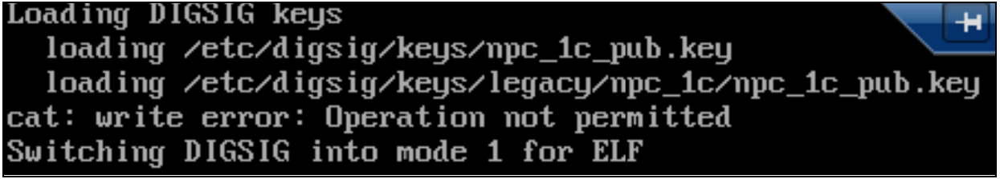

Рисунок 

Операционная система функционирует в режиме замкнутой программной среды.

## 4.6. Настройки сети

Для работы в сети необходимо на клиентских рабочих местах в файле /etc/hosts явно указать IP-адрес и имя сервера 1С:Предприятия.

Например:

10.1.2.34 server1c

На сервере 1С:Предприятия необходимо таким же образом явно указать IP-адреса и имена сервера баз данных (при использовании выделенного сервера баз данных) и клиентских компьютеров.

Например:

10.1.2.45 serverbd
10.1.2.06 user1

# 5. ОПИСАНИЕ ДЕЙСТВИЙ ПО БЕЗОПАСНОЙ УСТАНОВКЕ И НАСТРОЙКЕ СРЕДСТВА

## 5.1. Установка средства

Установка средства производится из deb-пакетов.

Состав и назначение deb-пакетов приведены в таблице 4.

Таблица 4 – состав и назначение deb-пакетов

| DEB-пакет | Назначение deb-пакета |
|-----------|------------------------|
| `1c-enterprise-8.3.24.1762-client-nls_8.3.24-1762_amd64.deb` | Пакет поддержки национальных символов для клиентских приложений |
| `1c-enterprise-8.3.24.1762-client_8.3.24-1762_amd64.deb` | Клиентские приложения (конфигуратор, толстый клиент и тонкий клиент) «1С:Предприятие» |
| `1c-enterprise-8.3.24.1762-common-nls_8.3.24-1762_amd64.deb` | Пакет поддержки национальных символов для общих компонент |
| `1c-enterprise-8.3.24.1762-common_8.3.24-1762_amd64.deb` | Общие компоненты |
| `1c-enterprise-8.3.24.1762-crs_8.3.24-1762_amd64.deb` | Сервер хранилища «1С:Предприятие» |
| `1c-enterprise-8.3.24.1762-server-nls_8.3.24-1762_amd64.deb` | Пакет поддержки национальных символов для компонент сервера «1С:Предприятие» |
| `1c-enterprise-8.3.24.1762-server_8.3.24-1762_amd64.deb` | Компоненты сервера «1С:Предприятие» и утилита контроля целостности |
| `1c-enterprise-8.3.24.1762-thin-client-nls_8.3.24-1762_amd64.deb` | Пакет поддержки национальных символов для тонкого клиента |
| `1c-enterprise-8.3.24.1762-thin-client_8.3.24-1762_amd64.deb` | Тонкий клиент «1С:Предприятие» |
| `1c-enterprise-8.3.24.1762-ws-nls_8.3.24-1762_amd64.deb` | Пакет поддержки национальных символов для адаптера публикаций «1С:Предприятие» |
| `1c-enterprise-8.3.24.1762-ws_8.3.24-1762_amd64.deb` | Адаптер публикаций «1С:Предприятие» |

### 5.1.1. Установка на сервер 1С:Предприятия

Описывается процесс установки ККТП «1С:Предприятие 8» на компьютер, выполняющий функции сервера 1С:Предприятия.

Под сервером 1С:Предприятия в данном случае следует понимать как сервер приложений – выделенный компьютер, выполняющий функции сервера приложений, доступ к которому имеет только администратор ККТП «1С:Предприятие 8», так и отдельный компьютер, выполняющий функции персонального компьютера, доступ к которому имеет пользователь (пользователи).

1) Вставить установочный диск средства в дисковод
2) Создать пустой каталог
3) Скопировать в созданный каталог программные пакеты, расположенные в каталоге deb установочного диска:
1c-enterprise-8.3.24.1762-client-nls_8.3.24-1762_amd64.deb;
1c-enterprise-8.3.24.1762-client_8.3.24-1762_amd64.deb;
1c-enterprise-8.3.24.1762-common-nls_8.3.24-1762_amd64.deb;
1c-enterprise-8.3.24.1762-common_8.3.24-1762_amd64.deb;
1c-enterprise-8.3.24.1762-crs_8.3.24-1762_amd64.deb;
1c-enterprise-8.3.24.1762-server-nls_8.3.24-1762_amd64.deb;
1c-enterprise-8.3.24.1762-server_8.3.24-1762_amd64.deb;
1c-enterprise-8.3.24.1762-ws-nls_8.3.24-1762_amd64.deb;
1c-enterprise-8.3.24.1762-ws_8.3.24-1762_amd64.deb.
4) Скопировать в каталог конфигурационные файлы, расположенные в каталогах ExtForms и units. 
5) Выполнить команду sudo dpkg -i *.deb

Примечание: Если использование графического режима функционирования операционной системы, установленной на сервере 1С:Предприятия не предусмотрено, то установки пакетов

1c-enterprise-8.3.24.1762-client-nls_8.3.24-1762_amd64.deb;
1c-enterprise-8.3.24.1762-client_8.3.24-1762_amd64.deb;
не требуется.
6) По окончанию установки пакетов проверить корректность установки командами:
sudo dpkg -s 1c-enterprise-8.3.24.1762-server
sudo dpkg -s 1c-enterprise-8.3.24.1762-client

При корректной установке пакетов буду выданы сообщения, с информацией об установленных пакетах.

Необходимо проверить корректность функционирования средства в режиме замкнутой программной среды (в случае, если данная функциональность включена – см. п.4.5 настоящего Руководства).

Порядок проверки:

1) В терминале перейти в каталог исполняемых файлов программы
cd /opt/1cv8/x86_64/8.3.24.1762
2) И выполнить команду запуска 1С:Предприятия
./1cestart

При корректной настройке функциональности замкнутой программной среды появится окно выбора информационных баз и режимов работы.

При некорректной настройке ЗПС либо в случае попытки запуска версии 1С:Предприятия, не соответствующей требованиям замкнутой программной среды появится сообщение:

Ошибка сегментирования

### 5.1.2. Установка на клиентский компьютер

Пользователю ККТП «1С:Предприятие 8» разрешена работа только посредством тонкого клиента 1С:Предприятия.

Для установки пакетов тонкого клиента следует выполнить действия:

1) Создать пустой каталог;
2) Скопировать в него с установочного диска пакеты:
1c-enterprise-8.3.24.1762-thin-client-nls_8.3.24-1762_amd64.deb
1c-enterprise-8.3.24.1762-thin-client_8.3.24-1762_amd64.deb
3) В терминале перейти в созданный каталог и выполнить команду:
sudo dpkg -i *.deb
4) По окончанию установки пакетов проверить корректность установки командой:
sudo dpkg -s 1c-enterprise-8.3.24.1762-thin-client

В случае корректной установки будет выдано сообщение с информацией об установленном пакете.

В случае функционирования в режиме замкнутой программной среды, выполнить проверку.

Порядок проверки:
1) В терминале перейти в каталог исполняемых файлов программы
cd /opt/1cv8/x86_64/8.3.24.1762
2) И выполнить команду запуска 1С:Предприятия
./1cv8c

При корректной настройке функциональности замкнутой программной среды появится окно выбора информационных баз и режимов работы.

При некорректной настройке ЗПС либо в случае попытки запуска версии 1С:Предприятия, не соответствующей требованиям замкнутой программной среды появится сообщение:

Ошибка сегментирования

## 5.2. Настройка программы

Указанные в данном подразделе настройки выполняются на сервере 1С:Предприятия (см. пункт 5.1.1 данного Руководства).

### 5.2.1. Создание специальных пользователей ККТП «1С:Предприятие 8»

Создать пользователей ККТП «1С:Предприятие 8» от имени которых будут выполняться процессы на кластере серверов 1С:Предприятия. Далее, такие пользователи будут именоваться «специальными пользователями».

Процессы, запускаемые от имение специальных пользователей, будут работать на высоком уровне целостности.

От имени специальных пользователей будут запускаться процессы 1С:Предприятия под разными мандатными метками.

Имя специального пользователя должно содержать не более восьми знаков.

Рекомендуется следующий формат имени специального пользователя: us1cLC , где L – уровень мандатного разграничения доступа, а C – категории мандатного разграничения доступа. Например, по имени специального пользователя us1c21 сразу видно, что от его имени запускаются процессы с метками мандатного разграничения доступа 2:0:1 (второй уровень МРД, низкий уровень целостности и 1 категория МРД).

Как правило, для большинства информационных систем будет необходимым и достаточным создание только двух специальных пользователей – us1c00 и us1c10, от имени которых будут запускаться процессы на кластере серверов 1С:Предприятия, обрабатывающие конфиденциальную информацию (пользователь us1c00) и информацию, составляющую государственную тайну (пользователь us1c10).

Для описанного в подразделе 1.4 примера создадим специальных пользователей us1c00, us1c10, us1c11.

Создаем специального пользователя командой:

sudo useradd -c "1C L0xC0" -g grp1cv8 -m -r us1c00

где:

"-c" - комментарий (1С уровня 0 категории Нет);

"-g" – назначить первичную группу grp1cv8;

"-m" - создать домашний каталог (/home/us1c00);

"-r" - указание, что учетная запись пользователя относится к системным и UID будет меньше 1000;

us1c00 - само имя пользователя us1c00. Выполнить аналогичные процедуры для остальных специальных пользователей: 

sudo useradd -c "1C L1xC0" -g grp1cv8 -m -r us1c10

sudo useradd -c "1C L1xC1" -g grp1cv8 -m -r us1c11

### 5.2.2. Создание пользователей ОС для PostgreSQL

ВНИМАНИЕ! Обращение к базам данных от имени postgres не используется.

Создать пользователей ОС для PostgreSQL (далее, пользователи PostgreSQL) именам которых будут соответствовать роли СУД PostgreSQL.

В случае, если сервер баз данных и сервер 1С:Предприятия разнесены на разные компьютеры, то указанная процедура выполняется только на сервере баз данных.

В описываемом примере, сервер 1С:Предприятия и сервер баз данных совмещены в одном компьютере.

Рекомендуется следующий формат имени пользователя PostgreSQL: pgsqlLC, где L – уровень мандатного разграничения доступа, а C – категории мандатного разграничения доступа. Например, по имени пользователя pgsql21 сразу видно, что его имени соответствует роль СУБД PostgreSQL, от имени которой обслуживается база данных, с установленными метками мандатного разграничения доступа 2:0:1 (второй уровень МРД, низкий уровень целостности и 1 категория МРД).

Команда создания пользователя:

sudo useradd -c "PostgreSQL L0xC0" -G postgres -r -M pgsql00

где:

"-c" - комментарий (PostgreSQL уровня «0» категории «Нет»);

"-G" - включить в группу postgres;

"-r" - указание, что учетная запись пользователя относится к системным и его UID будет меньше 1000;

"-r" – указание, не создавать домашний каталог пользователя;

далее идет само имя пользователя pgsql00.

Домашний каталог для пользователей PostgreSQL не создается.

Выполнить аналогичные процедуры для остальных пользователей PostgreSQL:

sudo useradd -c "PostgreSQL L1xC0" -G postgres -r -M pgsql10

sudo useradd -c "PostgreSQL L1xC1" -G postgres -r -M pgsql11

### 5.2.3. Создание пользователя – администратора ККТП «1С:Предприятие 8»

Создать, как минимум, одного пользователя, который будет выполнять функции администратора ККТП «1С:Предприятие 8». Данный пользователь будет выполнять задачи по созданию и администрированию информационных баз.

Администратору средства необходимо разрешить использование терминала – включить в группу astra-console.

В описанном примере создается один пользователь, которому будут доступны для администрирования информационные базы, расположенные во всех трех узлах МУИБ (см. подраздел 2.1 данного Руководства).

Команда создания администратора ККТП «1С:Предприятие 8».

sudo useradd -c "1C admin 1C L0_L1xC0_C1" -G grp1cv8,astra-console -m admin1c

### 5.2.4. Назначение паролей

Назначить пароли пользователей.

Пример команды: sudo passwd admin1c

### 5.2.5. Назначение меток мандатного разграничения доступа

Назначить метки мандатного разграничения доступа созданным пользователям. Метки МРД назначаются:

Специальным пользователям и пользователям PostgreSQL метки назначаются строго на один узел информационных баз.

Администратору ККТП «1С:Предприятие 8» рекомендуется назначить метки МРД в виде диапазона, разрешающего работу со всеми узлами информационных баз.

#### 5.2.5.1. Метки МРД для специальных пользователей

Команда для специального пользователя us1c10
sudo pdpl-user -l 1:1 -c 0:0 us1c10
//-l это "эль", а не "1".
В результате появится сообщение вида
минимальный уровень:
 Уровень_1(1)
 максимальный уровень: Уровень_1(1)
 минимальная категория: Нет(0)
 максимальная категория: Нет(0)

Что означает, что данному пользователю доступна информация, ТОЛЬКО с метками МРД равными значению 1:0:0 (метка уровня целостности в процессе назначения меток МРД пользователей пропускается).

Повторить для специальных пользователей us1c00 и us1c11

sudo pdpl-user -l 0:0 -c 0:0 us1c00

sudo pdpl-user -l 1:1 -c 1:1 us1c11

#### 5.2.5.2. Метки МРД для пользователей PostgreSQL

По аналогии с предыдущим пунктом установить метки МРД для пользователей PostgreSQL. Приводится последовательность команд для всех трех пользователей:

sudo pdpl-user -l 0:0 -c 0:0 pgsql00

sudo pdpl-user -l 1:1 -c 0:0 pgsql10

sudo pdpl-user -l 1:1 -c 1:1 pgsql11

#### 5.2.5.3. Метки МРД для администратора средства

Администратору рекомендуется установить метки МРД в виде диапазона.

Команда:

sudo pdpl-user -l 0:1 -c 0:1 admin1c

### 5.2.6. Настройка домашних каталогов специальных пользователей

Необходимо настроить домашние каталоги специальных пользователей.

#### 5.2.6.1. Создание каталогов временных файлов

В каталогах специальных пользователей создать каталог TMP, предназначенных для хранения временных файлов, образующихся в процессе функционирования средства.

Пример для всех трех специальных пользователей:

sudo mkdir -p /home/us1c00/TMP

sudo mkdir -p /home/us1c10/TMP

sudo mkdir -p /home/us1c11/TMP

#### 5.2.6.2. Создание файлов .ef1c

Создать файл конфигурационный файл .ef1c и скопировать его в домашние каталоги специальных пользователей.

Пример для всех трех специальных пользователей:

Создать файл:

> .ef1c

Скопировать файл

sudo cp .ef1c /home/us1c00

sudo cp .ef1c /home/us1c10

sudo cp .ef1c /home/us1c11

В конфигурационные файлы .ef1c в прописать строку вида:

TMPDIR="/home/us1cLS/TMP"

например,TMPDIR="/home/us1c10/TMP/ "

Пример для всех трех специальных пользователей:

sudo echo 'TMPDIR="/home/us1c00/TMP" '> /home/us1c00/.ef1c

sudo echo 'TMPDIR="/home/us1c10/TMP" '> /home/us1c10/.ef1c

sudo echo 'TMPDIR="/home/us1c11/TMP" '> /home/us1c11/.ef1c

#### 5.2.6.3. Назначение владельцев каталогов и файлов

Назначить владельцами каталогов TMP и файлов .ef1c специальных пользователей.

Команды для всех трех специальных пользователей:

sudo chown us1c00:grp1cv8 /home/us1c00/TMP

sudo chown us1c00:grp1cv8 /home/us1c00/.ef1c

sudo chown us1c10:grp1cv8 /home/us1c10/TMP

sudo chown us1c10:grp1cv8 /home/us1c10/.ef1c

sudo chown us1c11:grp1cv8 /home/us1c11/TMP

sudo chown us1c11:grp1cv8 /home/us1c11/.ef1c

#### 5.2.6.4. Установка меток МРД для домашних каталогов специальных пользователей

Далее приводятся команды для всех трех специальных пользователей ККТП «1С:Предприятие 8»:

Установка меток МРД и флага CCNRA для домашних каталогов специальных пользователей.

sudo pdpl-file 0:0:0:CCNRA /home/us1c00

sudo pdpl-file 1:0:0:CCNRA /home/us1c10

sudo pdpl-file 1:0:1:CCNRA /home/us1c11

Установка меток МРД и флага CCNRA на подкаталоги Desktop.

sudo pdpl-file 0:0:0:CCNRA /home/us1c00/Desktop

sudo pdpl-file 1:0:0:CCNRA /home/us1c10/Desktop

sudo pdpl-file 1:0:1:CCNRA /home/us1c11/Desktop

Установка меток МРД для подкаталогов TMP

sudo pdpl-file 0:0:0 /home/us1c00/TMP

sudo pdpl-file 1:0:0 /home/us1c10/TMP

sudo pdpl-file 1:0:1 /home/us1c11/TMP

Установка меток МРД для файлов .ef1c

sudo pdpl-file 0:0:0 /home/us1c00/.ef1c

sudo pdpl-file 1:0:0 /home/us1c10/.ef1c

sudo pdpl-file 1:0:1 /home/us1c11/.ef1c

### 5.2.7. Создание ролей PostgreSQL

Необходимо создать роли СУБД PostgreSQL от имени которых будет происходить обращение к базам данных (пользователи pgsql00, pgsql10 и pgsql11 были созданы в пункте 4.2.2).

В случае, если сервер баз данных и сервер 1С:Предприятия разнесены на разные компьютеры, то указанная процедура выполняется только на сервере баз данных.

В описываемом примере, сервер 1С:Предприятия и сервер баз данных совмещены в одном компьютере.

Следует выполнить команды:

sudo su postgres

createuser -sdlrP pgsql00

createuser -sdlrP pgsql10

createuser -sdlrP pgsql11

exit

В процессе создания ролей по команде createuser потребуется установить пароли для вновь создаваемых ролей.

Установить пароли.

### 5.2.8. Настройка юнитов

Запуск процессов 1С:Предприятия от имени специальных пользователей производится посредством конфигурационных файлов (юнитов) системы инициализации systemd.

Рекомендуемые шаблоны конфигурационных файлов расположены в каталоге units установочного диска ККТП «1С:Предприятие 8».

Рекомендуется файлы юнитов именовать по следующему правилу:

юниты сервера администрирования (ras) – r1cLC.service;

юниты служб кластера серверов (rac) – s1cLC.service;

где L – уровень мандатного разграничения доступа, а C – категории мандатного разграничения доступа.

Имена файлов юнитов и номера портов процессов 1С:Предприятия могут быть отредактированы. Главное условие – чтобы номера портов не пересекались с портами других процессов. Стандартные номера портов, такие как 1540, 1541, 1545, 1560:1762 использовать не рекомендуется.

Текст юнита сервера администрирования с комментариями для мандата 1:0:0 приведен на листинге 1.

```systemd
[Unit]
Description=1C:Remote Administration Server [2]
After=network.target remote-fs.target nss-lookup.target
[Service]
Type=simple
PDPLabel=1:63:0
#указание на уровень и категорию МРД
ExecStart=/opt/1cv8/x86_64/8.3.24.1762/ras cluster --port=8107 localhost:8100
#номер порта ras и порта агента кластера
User=us1c10
Group=grp1cv8
#имя специального пользователя и группы 1С:Предпрития,
#от имени которого запускается служба
WorkingDirectory=/home/us1c10
EnvironmentFile=/home/us1c10/.ef1c
#домашний каталог и ссылка на файл профиля, где указан каталог временных файлов
UMask=0002
PermissionsStartOnly=true
LimitCORE=infinity
LimitNOFILE=16384
[Install]
WantedBy=multi-user.target
```

Текст юнита служб кластера серверов с комментариями для мандата 1:0:0 приведен на листинге 2.

```systemd
[Unit]
Description=1C:Enterprise Server [1]
After=network.target remote-fs.target nss-lookup.target
[Service]
Type=forking
PDPLabel=1:63:0
ExecStart=/ opt/1cv8/x86_64/8.3.24.1762/ragent -daemon -debug -port 8100
-regport 8101 -range 8102:8106 -seclev 0
# указаны номера портов агента кластера (ragent),
# главного менеджера кластера (rmngr)
# и диапазон портов динамического выбора (rphost)
#уровень безопасности кластера серверов установлен как «по умолчанию»
#Параметры PDPLabel, User, Group, WorkingDirectory и EnvironmentFile
#описаны в примере юнита сервера администрирования ras.
User=us1c10
Group= grp1cv8
WorkingDirectory=/home/us1c10
EnvironmentFile=/home/us1c10/.ef1c
UMask=0002
PermissionsStartOnly=true
LimitCORE=infinity
LimitNOFILE=16384
[Install]
WantedBy=multi-user.target
```

В описываемом примере потребуется создание еще двух юнитов для запуска процессов в мандате 1:0:1.

Следует создать и откорректировать файлы с именами r1c11.service и s1c11.service.

Взять за основу файл шаблонов юнитов.

В указанных файлах параметр PDPLabel привести в виду PDPLabel=1:0:1

Номера портов привести к значениям:

− порт ras – 8207
− порт ragent – 8200
− порт rmngr – 8201
− диапазаон портов rphost – 8202:8206

В параметре User установить значение us1c11

В параметрах WorkingDirectory и EnvironmentFile домашний каталог пользователя заменить на us1c11 .

В конечном итоге, файлы r1c11.service и s1c11.service следует привести к виду, указанному в листингах 3 и 4 соответственно.

НАПОМИНАНИЕ!

Описываемый пример создания файлов юнитов, обслуживающих процессы с метками мандатного разграничения доступа, актуален только для данного примера и в случае реальной необходимости. Для большинства случаев, как уже указывалось ранее, достаточно и расположенных на установочном диске шаблонов юнитов.

```systemd
[Unit]
Description=1C:Remote Administration Server [2]
After=network.target remote-fs.target nss-lookup.target
[Service]
Type=simple
PDPLabel=1:63:1
ExecStart=/opt/1cv8/x86_64/8.3.24.1762/ras cluster --port=8207 localhost:8200
User=us1c11
Group=grp1cv8
WorkingDirectory=/home/us1c10
EnvironmentFile=/home/us1c10/.ef1c
UMask=0002
PermissionsStartOnly=true
LimitCORE=infinity
LimitNOFILE=16384
[Install]
WantedBy=multi-user.target
```

Листинг 3

```systemd
[Unit]
Description=1C:Enterprise Server [1]
After=network.target remote-fs.target nss-lookup.target
[Service]
Type=forking
PDPLabel=1:63:1
ExecStart=/ opt/1cv8/x86_64/8.3.24.1762/ragent -daemon -debug -port 8200
-regport 8201 -range 8202:8206 -seclev 0
User=us1c11
Group= grp1cv8
WorkingDirectory=/home/us1c11
EnvironmentFile=/home/us1c11/.ef1c
UMask=0002
PermissionsStartOnly=true
LimitCORE=infinity
LimitNOFILE=16384
[Install]
WantedBy=multi-user.target
```

Листинг 4

### 5.2.9. Запуск юнитов systemd

#### 5.2.9.1. Назначить владельца юнитов

Следует установить владельца юнитов, как шаблонных так и созданных.

Для этого необходимо создать пустой каталог, например, units и сложить туда все требуемые юниты.

Далее, выполнить команду: sudo chown -R root:root unints

#### 5.2.9.2. Перемещение юнитов

Переместить юниты в каталог /etc/systemd/system

Рекомендуется использовать команду mv.

#### 5.2.9.3. Переконфигурирование systemd

Выполнить команду переконфигурации systemd командой:

sudo systemctl daemon-reload

#### 5.2.9.4. Запуск процессов ККТП «1С:Предприятие 8»

Стартовать юниты командой sudo systemctl start [юнит]

Приводится пример для всех шести юнитов:

sudo systemctl start r1c00.service

sudo systemctl start r1c10.service

sudo systemctl start r1c11.service

sudo systemctl start s1c00.service

sudo systemctl start s1c10.service

sudo systemctl start s1c11.service

Поставить юниты в автозагрузку командой sudo systemctl enable [юнит]

sudo systemctl enable r1c00.service

sudo systemctl enable r1c10.service

sudo systemctl enable r1c11.service

sudo systemctl enable s1c00.service

sudo systemctl enable s1c10.service

sudo systemctl enable s1c11.service

#### 5.2.10. Проверка корректности запуска процессов

Выборочно проверить корректность запуска процессов средства.

При корректной настройке должны стартовать по три экземпляра каждого процесса, функционирующие под разными метками мандатного разграничения доступа. Процессы служб кластера серверов 1С:Предприятия следует проверять с отбором LIST, во избежание слишком большого вывода листинга.

Процессы сервера администрирования

Команда:

sudo netstat -talnpu |grep ras

Ответ:

tcp 0 0 0.0.0.0:8207 0.0.0.0:* LISTEN 697/ras

tcp 0 0 0.0.0.0:8007 0.0.0.0:* LISTEN 694/ras

tcp 0 0 0.0.0.0:8107 0.0.0.0:* LISTEN 695/ras

Процессы агента сервера 1С:Предприятия

Команда:

sudo netstat -talnpu |grep ragent |grep LIST

Ответ:

tcp 0 0 0.0.0.0:8000 0.0.0.0:* LISTEN 851/ragent

tcp 0 0 0.0.0.0:8100 0.0.0.0:* LISTEN 848/ragent

tcp 0 0 0.0.0.0:8200 0.0.0.0:* LISTEN 841/ragent

tcp6 0 0 :::8000 :::* LISTEN 851/ragent

tcp6 0 0 :::8100 :::* LISTEN 848/ragent

tcp6 0 0 :::8200 :::* LISTEN 841/ragent

Процессы менеджера кластера серверов 1С:Предприятия

Команда:

sudo netstat -talnpu |grep rmngr |grep LIST

Ответ:

tcp 0 0 0.0.0.0:8001 0.0.0.0:* LISTEN 900/rmngr

tcp 0 0 0.0.0.0:8101 0.0.0.0:* LISTEN 885/rmngr

tcp 0 0 0.0.0.0:8201 0.0.0.0:* LISTEN 918/rmngr

tcp6 0 0 :::8001 :::* LISTEN 900/rmngr

tcp6 0 0 :::8101 :::* LISTEN 885/rmngr

tcp6 0 0 :::8201 :::* LISTEN 918/rmngr

Процессы диапазона рабочих процессов кластера серверов

Команда:

sudo netstat -talnpu |grep rphost |grep LIST

Ответ:

tcp 0 0 0.0.0.0:8002 0.0.0.0:* LISTEN 1352/rphost

tcp 0 0 0.0.0.0:8102 0.0.0.0:* LISTEN 1351/rphost

tcp 0 0 0.0.0.0:8202 0.0.0.0:* LISTEN 1350/rphost

tcp6 0 0 :::8002 :::* LISTEN 1352/rphost

tcp6 0 0 :::8102 :::* LISTEN 1351/rphost

tcp6 0 0 :::8202 :::* LISTEN 1350/rphost

Выборочная проверка мандатных меток процессов по PID

Проверим процесс ras (PID 694), ragent (PID 848), rmngr (PID 918) и rphost (PID 1351).

Команда проверки:

sudo pdpl-ps [PID]

sudo pdpl-ps 694

694 Уровень_0:Низкий:Нет:0x0!Нет:Нет

sudo pdpl-ps 848

848 Уровень_1:Низкий:Нет:0x0!Нет:Нет

sudo pdpl-ps 918

918 Уровень_1:Низкий:Категория_1:0x0!Нет:Нет

sudo pdpl-ps 1351

1351 Уровень_1:Низкий:Нет:0x0!Нет:Нет

Из представленных тестов видно, что все процессы запущены и функционируют под заданными метками мандатного разграничения доступа.

Установка и настройка ККТП «1С:Предприятие 8» завершена.

## 5.3. Активация программной лицензии

Прежде чем приступить к созданию информационных баз, необходимо выполнить процедуру активации программных лицензий.

Без прохождения указанной процедуры, сработает система защиты от нелегального
копирования и программа не запустится в графическом режиме, равно как и не будет выполнять
функции сервера приложений – сервера 1С:Предприятия.

Далее будет описан пример активации программных лицензий основной поставки
(Защищенный программный комплекс «1С:Предприятие 8s». Технологическая поставка») и
лицензии на сервер 1С:Предприятия.

ВНИМАНИЕ! В отличие от активации программных лицензий типовой версии
1С:Предприятия, выполняемой от имени суперпользователя, активации программной лицензии
для ККТП «1С:Предприятие 8» производится:

− от имени администратора ККТП «1С:Предприятие 8»;

− под нулевыми метками мандатного разграничения доступа.

Для получения программной лицензии понадобится документ, входящий в поставку
программы, в котором указаны:

− вид используемого программного продукта:

− основная поставка;

− клиентская лицензия;

− лицензия на сервер «1С:Предприятия 8»;

− комплект, сочетающий в себе перечисленные виды продуктов;

− регистрационный номер программного продукта;

− пинкоды для получения программной лицензии.

− На обороте документа содержатся рекомендации по получению программной
лицензии.

Документ упакован в конверт с надписью «Пинкоды программной лицензии».

В процессе получения лицензии потребуется ввести следующие данные:

− регистрационный номер продукта;

− пинкод;

− информацию о владельце лицензии.

При получении программной лицензии происходит сбор информации о компьютере
(ключевые параметры), на который будет установлена лицензия. Если в процессе дальнейшей
работы будет изменен хотя бы один из ключевых параметров, необходимо будет заново получить
программную лицензию (или лицензии, если на компьютере установлено несколько лицензий),
используя для этого резервный пинкод (восстановление лицензии).

Список ключевых параметров:

− наименование операционной системы;

− версия операционной системы;

− сетевое имя компьютера;

− модель материнской платы;

− объем оперативной памяти;

− тип и версия BIOS;

− список процессоров и их параметры;

− список сетевых адаптеров и их MAC-адреса;

− список жестких дисков и их параметры.

При использовании программы на виртуальных компьютерах необходимо получение
программной лицензии на каждый виртуальный компьютер. При использовании виртуальных
машин программная лицензия привязывается к параметрам виртуальной машины (параметры
виртуальной машины эквивалентны параметрам реального компьютера и перечислены выше).
Изменение этих параметров потребует повторного получения лицензии по новому пинкоду.

При изменении ключевых параметров компьютера нужно помнить о следующих особенностях:

При проверке информации о компьютере анализируется только удаление, а не добавление
устройств. Например, при получении программной лицензии на компьютере был установлен один сетевой адаптер. Допустимо добавить еще один сетевой адаптер без необходимости повторного
получения программной лицензии, но нельзя заменить один сетевой адаптер на другой.

Оперативную память на компьютере допустимо увеличивать, но нельзя уменьшать.
Например, получение лицензии выполнялась с оперативной памятью, равной 2 Гбайт. Без
необходимости повторного получения программной лицензии имеется возможность увеличить
память до 6 Гбайт, а потом уменьшить ее объем до 4 Гбайт. Однако уменьшение объема
оперативной памяти ниже 2 Гбайт приведет к необходимости повторного получения программной
лицензии.

Изменения анализируются по текущему состоянию компьютера относительно того
состояния, когда выполнялась привязка лицензии.

### 5.3.1. Подготовка к активации программной лицензии

Активацию программных лицензий рекомендуется проводить до того момента, как
компьютер будет аттестован.

Для активации программной лицензии необходимы как полномочия администратора ККТП
«1С:Предприятие 8», так и администратора операционной системы.

Перезагрузить компьютер и войти под администратором 1С:Предприятия с нулевыми
метками мандатного разграничения доступа. Пример приведен на рисунках 2 и 3.


Рисунок 2

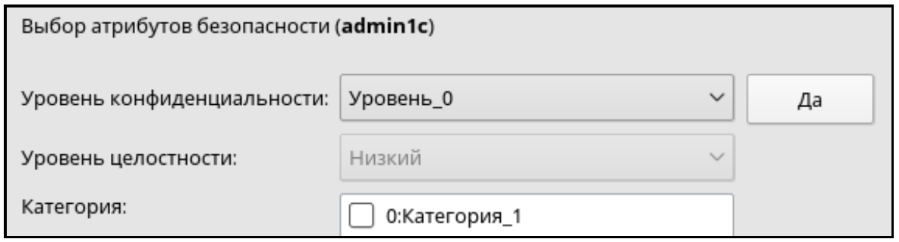

Рисунок 3

Убедиться, что к компьютеру не подключены USB-накопители.

### 5.3.2. Активация первой лицензии

#### 5.3.2.1. Подготовка к активации первой программной лицензии

Создать пустую информационную базу. Пуск – Офис – 1C:Enterprise 64(8.3.24.1762) – Добавить информационную базу.

Открыть информационную базу в режиме Конфигуратор. Поскольку программная лицензия не активирована, то будет выдано сообщение об отсутствии лицензии (рис.4)

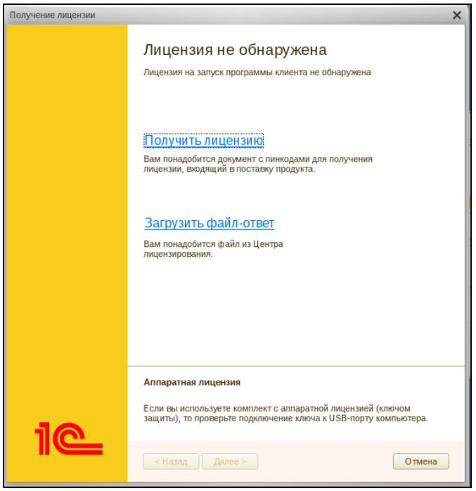

Рисунок 4

Выбрать меню «Получить лицензию» – откроется диалог «Операции с лицензией» (рис.5). Выбрать меню «Первый запуск».

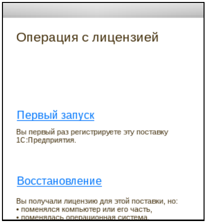

Рисунок 5

#### 5.3.2.2. Диалог «Регистрация комплекта»

Откроется диалог «Регистрация комплекта». Ввести регистрационный номер основной поставки, указанный на желтом бланке лицензионного соглашения, а также, указанный в разделах 7 и 8 формуляра средства.

Далее:

1) Вскрыть конверт с пин-кодами активации и ввести первый из пин-кодов.
2) Нажать на пункт меню «Дополнительно» и выполнить действия:
3) Взвести флаг «Установка на сервер»;
4) Снять флаг «Автоматическое получение»
5) Наименование сервера указать как localhost;
6) Номер порта по умолчанию 1540 исправить на 8000;
7) Нажать на кнопку «Далее»

Пример работы с диалогом «Регистрация комплекта» приведен на рисунке 6.

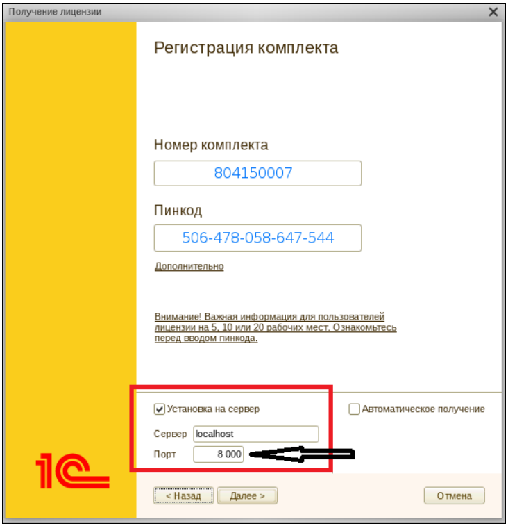

Рисунок 6

Откроется меню «Владелец лицензии». Следует ввести данные о предприятии и о лице, ответственном за эксплуатацию программы. По окончанию ввода взвести флаг «Я согласен повторить эти данные с точностью до символа» и нажать на кнопку «Сохранить данные». Данные будут сохранены в текстовый файл LicData.txt (рис.8).

Нажать на кнопку «Далее».

Пример работы с диалогом «Владелец лицензии» приведен на рис.7.

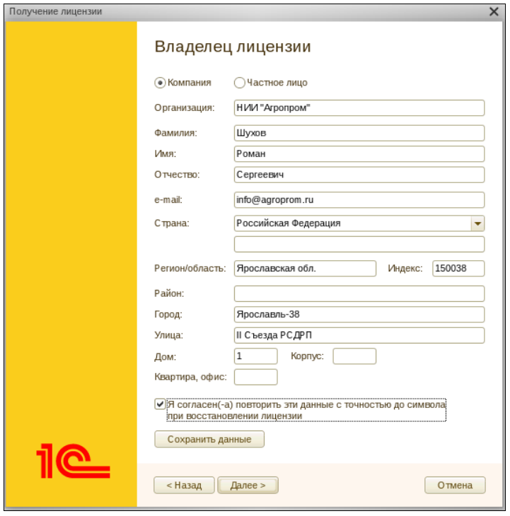

Рисунок 7

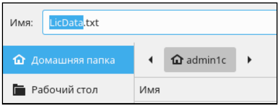

Рисунок 8

Откроется диалог выбора привязки получаемой лицензии.

Выбрать вариант «К компьютеру» (рис. 9).

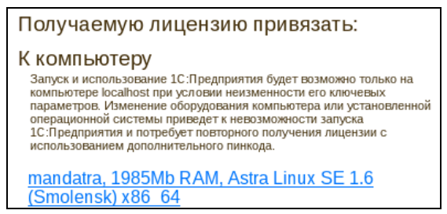

Рисунок 9

Подтвердить вариант привязки кликнув по ссылке. Появится диалог подтверждения варианта привязки программной лицензии (рис.10).

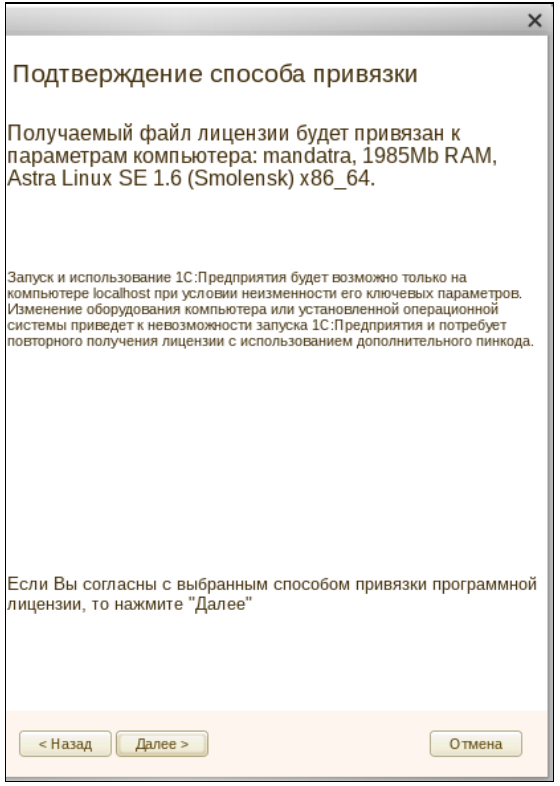

Рисунок 10

Появится диалог выбора способа получения лицензии.

Выбрать «На электронном носителе (через файл)» (рис.11).

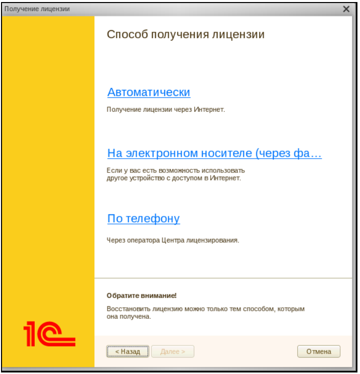

Рисунок 11

Появится диалог регистрации лицензии (рис 12).

Следует нажать на кнопку «Сохранить». Будет сформирован файл запроса лицензии вида «txNNNNNN.txt» (рис.13).

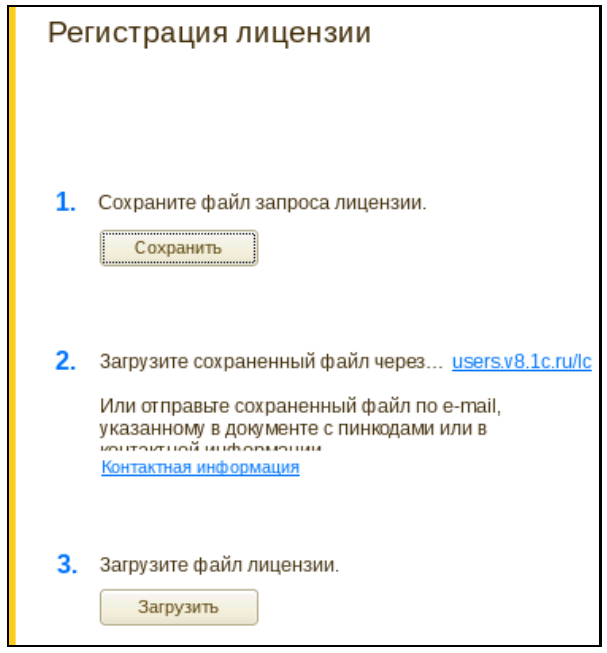

Рисунок 12

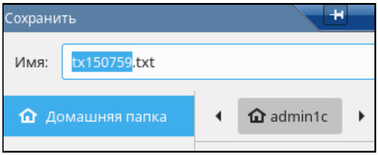

Рисунок 12

Сохранить файл в выбранном каталоге.

Далее следует посредством отдельной сессии войти в компьютер от имени администратора операционной системы.

#### 5.3.2.3. Операции, выполняемые администратором операционной системы

Команда: Пуск – Завершение работы – Новый вход – Отдельный – ввести логин и пароль администратора операционной системы. Пример на рис.13.

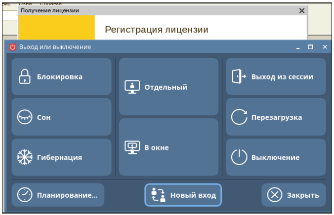

Рисунок 13

Далее рекомендуется воспользоваться терминалом.

1) Войти в терминал и дать команду: sudo mc
2) Переместить файл запроса лицензии в домашний каталог администратора операционной системы;
3) Поменять владельца файла. Пример: sudo chown administrator:admininstrator tx150759.txt
4) Примонтировать USB-накопитель либо CD-R диск;
5) Скопировать файл запроса на USB-накопитель либо на CD-R диск;
6) Отмонтировать и извлечь USB-накопитель либо CD-R диск.

Как вариант, если использование USB-накопителей запрещено, использовать CD- или DVD-диск.

Далее необходимо перенести USB-накопитель либо CD/DVD-диск к компьютеру, подключенному к сети Интернет и в браузере набрать адрес Центра лицензирования фирмы «1С» http://users.v8.1c.ru/lc (lc - это «ЭльСи», а не «1С», не перепутайте.)

Откроется сайт Центра лицензирования 1С (рис. 14)

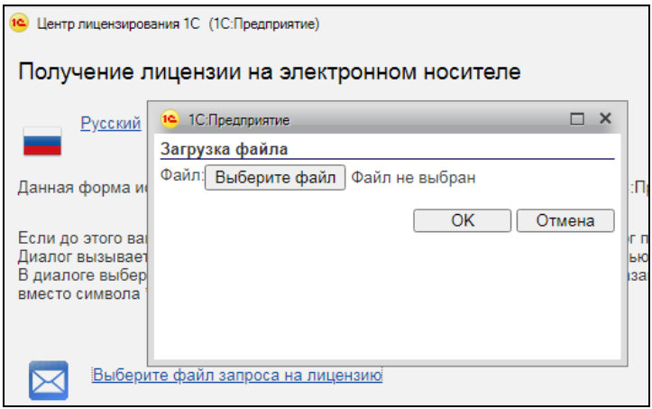

Выбрать файл запроса лицензии и нажать кнопку «ОК».

В случае корректно сформированного файла запроса будет сформирован файл ответа вида «rxNNNNNN.txt». Например, rx150759.txt

Далее:

1) Загрузить полученный файл ответа по кнопке на сайте «Сохраните файл лицензии».
2) USB-носитель с полученным файлом ответа примонтировать к компьютеру и от имени администратора операционной системы выполнить команды:
3) Сменить владельца файла на администратора 1С:Предприятия.

Пример команды: chown admin1c:grp1cv8 rx150759.txt

4) Переместить файл ответа в домашний каталог администратора 1С:Предприятия.

Рекомендуемая команда: sudo mc и далее по F6 переместить в требуемый каталог.

5) Выйти из сессии администратора операционной системы:
Пуск – Завершение работы – Сессия

#### 5.3.2.4. Продолжение работы администратором 1С:Предприятия

В сессии администратора ККТП «1С:Предприятие 8» открыт Конфигуратор и ожидается загрузка файла лицензии (рис.12).

1) Загрузить файл лицензии, полученный на предыдущем этапе процесса. В описываемом примере, это файл rx150759.txt.
2) Дождаться появления сообщения об успешной активации программной лицензии.
3) Проверить наличие файла с расширением *.lic в каталоге /var/1C/licenses

Данный каталог создается автоматически и предварительно его создавать не требуется.

Подтверждением того, что лицензия успешно активирована будет запуск Конфигуратора. Без активированной программной лицензии программа не запустится.

#### 5.3.3. Активация дополнительных клиентских лицензий

В случае, если необходимо активировать клиентские лицензии на дополнительное количество рабочих мест, необходимо войти в Конфигуратор и далее посредством меню «Сервис – Получение лицензии» (рис.15) выбрать пункт «Получить лицензию» (рис.4).

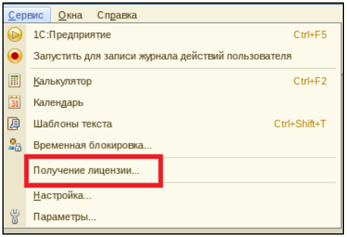

Рисунок 15

Далее выполнить операции, описанные в подпунктах 4.3.2.2 – 4.3.2.4 настоящего Руководства.

#### 5.3.4. Активация лицензии на сервер


